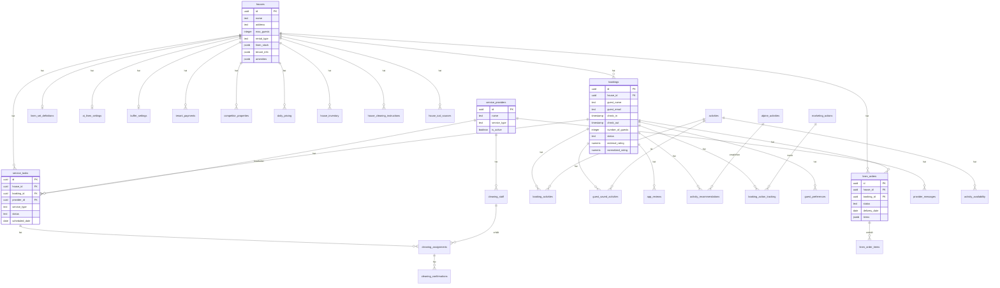

# Datenbank-Relationalitätsbewertung

**Datum:** 17. Dezember 2025  
**Status:** Analyse abgeschlossen  
**Bewertung:** ⚠️ Teilweise relational (Verbesserungspotenzial)

---

## Executive Summary

### Gesamtbewertung: 45/100 (Relationalitäts-Score)

| Kriterium | Status | Bewertung |
|-----------|--------|-----------|
| Foreign Keys definiert | ❌ 0 von ~70 | 0/25 |
| Primärschlüssel vorhanden | ✅ Alle Tabellen | 25/25 |
| JSONB-Nutzung (angemessen) | ⚠️ Übermäßig (~60+ Felder) | 10/25 |
| Daten-Normalisierung | ⚠️ Denormalisiert | 10/25 |

### Hauptprobleme

1. **Keine Foreign Key Constraints** - Referentielle Integrität wird nur auf Applikationsebene erzwungen
2. **Übermäßige JSONB-Nutzung** - Viele Felder könnten normalisiert werden
3. **Gästdaten denormalisiert** - Gäste-Informationen direkt in `bookings` Tabelle
4. **Fehlende Indizes auf Fremdschlüssel-Spalten**

---

## Detaillierte Analyse

### 1. Foreign Key Status

**Aktuelle Situation:** 0 Foreign Keys definiert

Die Datenbank enthält viele UUID-Spalten mit `_id` Suffix, die logische Beziehungen darstellen, aber keine FK-Constraints haben:

```
bookings.house_id → houses.id (FEHLT)
service_tasks.house_id → houses.id (FEHLT)
service_tasks.booking_id → bookings.id (FEHLT)
linen_orders.house_id → houses.id (FEHLT)
linen_orders.booking_id → bookings.id (FEHLT)
cleaning_assignments.service_task_id → service_tasks.id (FEHLT)
...und ~65 weitere
```

**Risiken ohne Foreign Keys:**
- Verwaiste Datensätze möglich (z.B. booking_id zu gelöschter Buchung)
- Keine Datenbank-Level Validierung
- Cascade-Löschungen müssen manuell in Code implementiert werden
- Performance-Probleme bei JOINs ohne passende Indizes

### 2. JSONB-Nutzung

**Angemessene JSONB-Nutzung (flexible Daten):**
- `houses.amenities` - Variable Ausstattungsmerkmale
- `houses.pricing_config` - Flexible Preiskonfiguration
- `ai_optimization_results.optimization_result` - KI-Analyseergebnisse
- `guest_preferences.predicted_interests` - ML-generierte Daten

**Problematische JSONB-Nutzung (sollte normalisiert werden):**

| Tabelle | Feld | Problem | Empfehlung |
|---------|------|---------|------------|
| `houses` | `linen_stock` | Standardisierte Struktur | Separate `house_linen_stock` Tabelle |
| `houses` | `tenant_info` | Strukturierte Mieterdaten | Bereits geplant: `tenants` Tabelle |
| `houses` | `additional_fees` | Wiederkehrende Struktur | `house_fees` Tabelle |
| `linen_set_definitions` | `custom_categories` | Item-Definitionen | `linen_item_definitions` Tabelle |
| `ai_linen_settings` | `prices` | Item-Preise | `linen_item_prices` Tabelle |
| `buffer_settings` | `min_buffer_stock` | Item-Mengen | `house_buffer_stock` Tabelle |

### 3. Denormalisierungsprobleme

**Gästdaten in `bookings` Tabelle:**
```sql
-- Aktuell in bookings:
guest_name, guest_email, guest_phone, guest_street, 
guest_city, guest_postal_code, guest_birth_date, 
guest_travel_document, guest_notes, nationality
```

**Problem:** Gleicher Gast mit mehreren Buchungen → Daten-Redundanz und Inkonsistenz-Risiko

**Lösung:** Separate `guests` Tabelle (Plan existiert in `docs/Guest-Booking-Separation-Plan.md`)

---

## Tabellen-Kategorisierung

### Kern-Tabellen (12)
Primäre Geschäftsobjekte:

| Tabelle | Beschreibung | Wichtige Beziehungen |
|---------|--------------|----------------------|
| `houses` | Ferienobjekte | Zentrale Entität |
| `bookings` | Buchungen | → houses |
| `service_tasks` | Aufgaben (Reinigung) | → houses, bookings |
| `service_providers` | Dienstleister | - |
| `linen_orders` | Wäschebestellungen | → houses, bookings |
| `linen_set_definitions` | Wäsche-Regeln | → houses |
| `tenant_payments` | Mietzahlungen | → houses |
| `cleaning_staff` | Reinigungspersonal | → service_providers |
| `cleaning_assignments` | Zuweisungen | → service_tasks, cleaning_staff |
| `cleaning_automation_settings` | Automatisierung | → service_providers |
| `provider_messages` | Nachrichten | → service_providers |
| `email_templates` | E-Mail-Vorlagen | - |

### Konfigurations-Tabellen (8)
System- und App-Einstellungen:

| Tabelle | Beschreibung |
|---------|--------------|
| `system_settings` | Zentrale Einstellungen |
| `ai_linen_settings` | KI-Parameter pro Haus |
| `buffer_settings` | Mindestbestand pro Haus |
| `booking_linen_config` | Wäsche-Konfiguration |
| `linen_automation_settings` | Automatisierung |
| `cleaning_settings` | Reinigungseinstellungen |
| `app_modules_config` | Modul-Konfiguration |
| `booking_card_config` | UI-Konfiguration |

### Analyse-/KI-Tabellen (5)
Optimierungsergebnisse und Muster:

| Tabelle | Beschreibung |
|---------|--------------|
| `ai_optimization_results` | KI-Analysen pro Haus |
| `guest_behavior_patterns` | Gästeverhaltensmuster |
| `guest_preferences` | Gästepräferenzen |
| `competitor_properties` | Wettbewerber |
| `daily_pricing` | Preisverlauf |

### Aktivitäts-App Tabellen (12)
Separate Aktivitäten-Funktionalität:

| Tabelle | Beschreibung |
|---------|--------------|
| `activities` | Aktivitäten-Katalog |
| `alpine_activities` | Alpen-spezifische Aktivitäten |
| `activity_availability` | Verfügbarkeit |
| `activity_cache` | Cache-Daten |
| `activity_recommendations` | Empfehlungen |
| `booking_activities` | Gebuchte Aktivitäten |
| `guest_saved_activities` | Gespeicherte Aktivitäten |
| `guest_preference_responses` | Präferenz-Antworten |
| `day_trips` | Tagesausflüge |
| `trip_plans` | Reisepläne |
| `app_reviews` | App-Bewertungen |
| `booking_inquiries` | Buchungsanfragen |

### Sonstige Tabellen (7)
Hilfstabellen und Logs:

| Tabelle | Beschreibung |
|---------|--------------|
| `cron_job_logs` | Cron-Job Protokoll |
| `blocked_bookings` | Blockierte Buchungen |
| `external_article_mapping` | Externe Artikel |
| `house_ical_sources` | iCal-Quellen |
| `house_inventory` | Haus-Inventar |
| `house_cleaning_instructions` | Reinigungsanleitungen |
| `laundry_invoices` | Wäscherei-Rechnungen |

---

## Beziehungsdiagramm (ERD)



---

## Empfohlene Maßnahmen

### Phase 1: Foreign Keys hinzufügen (Niedrig-Risiko)
**Aufwand:** 2-4 Stunden  
**Risiko:** Gering (nur Constraints, keine Datenänderung)

```sql
-- Kern-Beziehungen
ALTER TABLE bookings 
  ADD CONSTRAINT fk_bookings_house 
  FOREIGN KEY (house_id) REFERENCES houses(id) ON DELETE CASCADE;

ALTER TABLE service_tasks 
  ADD CONSTRAINT fk_service_tasks_house 
  FOREIGN KEY (house_id) REFERENCES houses(id) ON DELETE CASCADE;

ALTER TABLE service_tasks 
  ADD CONSTRAINT fk_service_tasks_booking 
  FOREIGN KEY (booking_id) REFERENCES bookings(id) ON DELETE SET NULL;

ALTER TABLE service_tasks 
  ADD CONSTRAINT fk_service_tasks_provider 
  FOREIGN KEY (provider_id) REFERENCES service_providers(id) ON DELETE SET NULL;

ALTER TABLE linen_orders 
  ADD CONSTRAINT fk_linen_orders_house 
  FOREIGN KEY (house_id) REFERENCES houses(id) ON DELETE CASCADE;

ALTER TABLE linen_orders 
  ADD CONSTRAINT fk_linen_orders_booking 
  FOREIGN KEY (booking_id) REFERENCES bookings(id) ON DELETE SET NULL;

-- Weitere wichtige FKs
ALTER TABLE cleaning_assignments 
  ADD CONSTRAINT fk_assignments_task 
  FOREIGN KEY (service_task_id) REFERENCES service_tasks(id) ON DELETE CASCADE;

ALTER TABLE cleaning_assignments 
  ADD CONSTRAINT fk_assignments_staff 
  FOREIGN KEY (cleaning_staff_id) REFERENCES cleaning_staff(id) ON DELETE SET NULL;

ALTER TABLE tenant_payments 
  ADD CONSTRAINT fk_payments_house 
  FOREIGN KEY (house_id) REFERENCES houses(id) ON DELETE CASCADE;

ALTER TABLE linen_set_definitions 
  ADD CONSTRAINT fk_linen_defs_house 
  FOREIGN KEY (house_id) REFERENCES houses(id) ON DELETE CASCADE;

ALTER TABLE ai_linen_settings 
  ADD CONSTRAINT fk_ai_settings_house 
  FOREIGN KEY (house_id) REFERENCES houses(id) ON DELETE CASCADE;

ALTER TABLE buffer_settings 
  ADD CONSTRAINT fk_buffer_house 
  FOREIGN KEY (house_id) REFERENCES houses(id) ON DELETE CASCADE;
```

### Phase 2: JSONB-Felder normalisieren (Mittel-Risiko)
**Aufwand:** 1-2 Tage  
**Risiko:** Mittel (erfordert Code-Änderungen)

**Priorität 1: Wäsche-Items**
```sql
-- Neue Tabelle für Wäsche-Item-Definitionen
CREATE TABLE linen_item_definitions (
  id UUID PRIMARY KEY DEFAULT gen_random_uuid(),
  house_id UUID NOT NULL REFERENCES houses(id) ON DELETE CASCADE,
  item_key TEXT NOT NULL,
  label TEXT NOT NULL,
  icon TEXT,
  category TEXT NOT NULL,
  quantity INTEGER DEFAULT 1,
  calculation_type TEXT DEFAULT 'per_guest',
  availability TEXT DEFAULT 'always',
  season TEXT,
  color TEXT,
  is_active BOOLEAN DEFAULT true,
  created_at TIMESTAMPTZ DEFAULT now(),
  updated_at TIMESTAMPTZ DEFAULT now(),
  UNIQUE(house_id, item_key)
);

-- Neue Tabelle für Wäsche-Preise
CREATE TABLE linen_item_prices (
  id UUID PRIMARY KEY DEFAULT gen_random_uuid(),
  house_id UUID NOT NULL REFERENCES houses(id) ON DELETE CASCADE,
  item_key TEXT NOT NULL,
  price NUMERIC(10,2) NOT NULL DEFAULT 0,
  currency TEXT DEFAULT 'EUR',
  created_at TIMESTAMPTZ DEFAULT now(),
  updated_at TIMESTAMPTZ DEFAULT now(),
  UNIQUE(house_id, item_key)
);

-- Neue Tabelle für Wäsche-Bestand
CREATE TABLE house_linen_stock (
  id UUID PRIMARY KEY DEFAULT gen_random_uuid(),
  house_id UUID NOT NULL REFERENCES houses(id) ON DELETE CASCADE,
  item_key TEXT NOT NULL,
  quantity INTEGER DEFAULT 0,
  min_buffer INTEGER DEFAULT 0,
  in_use INTEGER DEFAULT 0,
  in_cleaning INTEGER DEFAULT 0,
  reserved INTEGER DEFAULT 0,
  dirty INTEGER DEFAULT 0,
  created_at TIMESTAMPTZ DEFAULT now(),
  updated_at TIMESTAMPTZ DEFAULT now(),
  UNIQUE(house_id, item_key)
);
```

### Phase 3: Gäste-Tabelle implementieren (Hoch-Aufwand)
**Aufwand:** 3-5 Tage  
**Risiko:** Hoch (erfordert umfangreiche Code-Änderungen)

**Detaillierter Plan:** Siehe `docs/Guest-Booking-Separation-Plan.md`

```sql
-- Gäste-Tabelle
CREATE TABLE guests (
  id UUID PRIMARY KEY DEFAULT gen_random_uuid(),
  email TEXT UNIQUE,
  name TEXT NOT NULL,
  phone TEXT,
  street TEXT,
  city TEXT,
  postal_code TEXT,
  country TEXT,
  nationality TEXT,
  birth_date DATE,
  travel_document TEXT,
  notes TEXT,
  created_at TIMESTAMPTZ DEFAULT now(),
  updated_at TIMESTAMPTZ DEFAULT now()
);

-- Buchungen mit Gast-Referenz
ALTER TABLE bookings ADD COLUMN guest_id UUID REFERENCES guests(id);

-- Migrationsscript für existierende Daten
INSERT INTO guests (email, name, phone, street, city, postal_code, nationality, birth_date, travel_document, notes)
SELECT DISTINCT ON (guest_email) 
  guest_email, guest_name, guest_phone, guest_street, guest_city, 
  guest_postal_code, nationality, guest_birth_date, guest_travel_document, guest_notes
FROM bookings 
WHERE guest_email IS NOT NULL;

-- Buchungen updaten
UPDATE bookings b SET guest_id = g.id 
FROM guests g WHERE b.guest_email = g.email;
```

### Phase 4: Zusätzliche Gebühren normalisieren (Optional)
**Aufwand:** 4-6 Stunden  
**Risiko:** Niedrig

```sql
CREATE TABLE house_additional_fees (
  id UUID PRIMARY KEY DEFAULT gen_random_uuid(),
  house_id UUID NOT NULL REFERENCES houses(id) ON DELETE CASCADE,
  platform TEXT NOT NULL,
  fee_type TEXT NOT NULL,
  amount NUMERIC(10,2) NOT NULL,
  is_per_night BOOLEAN DEFAULT false,
  is_per_guest BOOLEAN DEFAULT false,
  is_percentage BOOLEAN DEFAULT false,
  created_at TIMESTAMPTZ DEFAULT now(),
  UNIQUE(house_id, platform, fee_type)
);
```

---

## Migrations-Reihenfolge

1. ✅ **ABGESCHLOSSEN (17.12.2025):** Foreign Keys (Phase 1) - 25+ FKs + 13 Indizes
2. ⏳ **Nach Tests:** JSONB-Normalisierung (Phase 2)
3. 📅 **Geplant:** Gäste-Separation (Phase 3) - nach Activities-App Refactoring
4. 💡 **Optional:** Gebühren-Normalisierung (Phase 4)

---

## Monitoring nach Migration

Nach Implementierung der Foreign Keys:

```sql
-- Verwaiste Datensätze finden
SELECT * FROM bookings WHERE house_id NOT IN (SELECT id FROM houses);
SELECT * FROM service_tasks WHERE house_id NOT IN (SELECT id FROM houses);
SELECT * FROM service_tasks WHERE booking_id NOT IN (SELECT id FROM bookings);
SELECT * FROM linen_orders WHERE house_id NOT IN (SELECT id FROM houses);
SELECT * FROM linen_orders WHERE booking_id NOT IN (SELECT id FROM bookings);

-- Indizes für Performance
CREATE INDEX idx_bookings_house_id ON bookings(house_id);
CREATE INDEX idx_service_tasks_house_id ON service_tasks(house_id);
CREATE INDEX idx_service_tasks_booking_id ON service_tasks(booking_id);
CREATE INDEX idx_linen_orders_house_id ON linen_orders(house_id);
CREATE INDEX idx_linen_orders_booking_id ON linen_orders(booking_id);
```

---

## Zusammenfassung

Die Datenbank ist **strukturell vorbereitet** für relationale Integrität (UUID-Spalten, logische Beziehungen), aber **nicht vollständig relational** implementiert (fehlende FK-Constraints, übermäßige JSONB-Nutzung).

**Empfohlene sofortige Aktion:** Phase 1 (Foreign Keys) kann ohne Risiko implementiert werden und verbessert Datenintegrität sofort.

**Langfristige Vision:** Vollständig normalisierte Datenbank mit separater Gäste-Tabelle, normalisierten Wäsche-Items und Foreign Keys auf allen Beziehungen.
