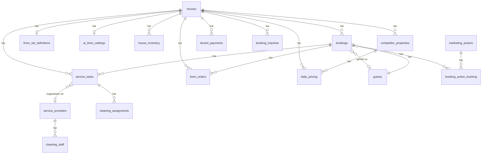

# Steinbock Chalets - Ferienhaus-Verwaltungssystem

## Vollständige System-Dokumentation für Project Knowledge

---

## 1. Projekt-Übersicht

**Name:** Steinbock Chalets - Ferienhaus-Verwaltungssystem

**Technologie-Stack:**
- Frontend: React 18, Vite, TypeScript, TailwindCSS
- State Management: TanStack React Query
- Routing: React Router v6
- UI-Komponenten: shadcn/ui (Radix UI)
- Backend: Supabase (PostgreSQL, Edge Functions)
- PWA-Fähig: vite-plugin-pwa

**Einstiegspunkt:** `src/App.tsx` mit QueryClient, Router und ChatAssistant

---

## 2. App-Architektur (Schichten)

### Core Layer
- `App.tsx` - Zentrale App mit QueryClientProvider, Router, Toaster, AppStatusBar
- `OriginalDashboard.tsx` - Haupt-Dashboard mit Tab-Navigation
- `ChatAssistant.tsx` - Floating AI-Assistent (immer sichtbar)
- `AppStatusBar.tsx` - PWA-Status und Connection-Anzeige

### UI Layer (8 Hauptmodule)

| Modul | Pfad | Hauptkomponenten |
|-------|------|------------------|
| Dashboard | `/` Tab "Übersicht" | StatsCards, RecentBookings, TaskOverview, Alert-Banner |
| Buchungen | Tab "Buchungen" | BookingOverviewFixed, CreateBookingDialog, EditBookingDialog |
| Häuser | Tab "Objekte" | HouseManagement, HouseCard, CreateHouseDialog, LinenDashboard |
| Gäste | Tab "Gäste" | GuestManagement, GuestList, GuestCommunication, GuestAnalytics |
| Reinigung | Tab "Reinigung" | CleaningManagement, CreateCleaningTaskDialog |
| Wäsche | Tab "Wäsche" | LinenDashboard, SmartLinenDashboard, LinenOrderDialog |
| Mieter | Tab "Mieter" | TenantManagement, TenantPayments, TenantContracts |
| Einstellungen | Tab "Einstellungen" | Email-Settings, Profile-Settings, RatingReminder-Settings |

### Data Layer (React Query Hooks)

| Hook | Funktion |
|------|----------|
| `useBookings` | Buchungen CRUD |
| `useHouses` | Häuser CRUD |
| `useServiceTasks` | Reinigungsaufträge CRUD |
| `useLinenManagement` | Wäschebestellungen |
| `useGuests` | Gäste-Management |
| `useDashboard` | Dashboard-Statistiken |
| `useRatingReminders` | Bewertungs-Erinnerungen |
| `useGuestContactReminders` | Gästekontakt-Erinnerungen |
| `useMarketingActions` | Marketing-Aktionen |
| `useTenantPayments` | Mieter-Zahlungen |

---

## 3. Datenbank-Schema (Kern-Tabellen)

### Primäre Entitäten

#### houses (Ferienhäuser und Langzeitvermietungen)
```
id, name, address, property_type (house/apartment/studio), rental_type (tourist/long_term),
max_guests, bedrooms, bathrooms, living_area_sqm, amenities (JSONB),
linen_stock, linen_dirty, linen_in_cleaning, linen_reserved, linen_in_use, ordered_linen (JSONB),
tenant_info (JSONB für Langzeitmieter), default_cleaning_hours, default_linen_color,
image_url, ical_url, pricing_config (JSONB), additional_fees (JSONB)
```

**Nebenkosten-Schema (additional_fees V2):**
```typescript
{
  service_fee:     { mode: 'flat' | 'per_person', amount: number },
  tourist_tax:     { mode: 'flat' | 'per_person', amount: number },
  cleaning_fee:    { mode: 'flat' | 'per_person', amount: number },
  electricity_fee: { mode: 'flat' | 'per_person', amount: number },
  linen_fee:       { mode: 'flat' | 'per_person', amount: number },
  vat_percentage:  number
}
```
- `flat` = Pauschal pro Aufenthalt
- `per_person` = pro Person (Kurtaxe zusätzlich pro Nacht)
- Legacy-Flat-Werte werden automatisch in V2-Objekte normalisiert.

#### bookings (Buchungen)
```
id, house_id (FK), guest_id (FK -> guests), guest_name, guest_email, guest_phone,
check_in, check_out, number_of_guests, number_of_adults, number_of_children,
status (confirmed/checked_in/completed/cancelled), booking_amount, currency,
payment_status (pending/paid/partial), platform, external_booking_id, external_rating,
normalized_rating, nationality, notes, guest_contact_status, rating_not_expected,
cancellation_date, cancellation_reason, cancelled_by
```

#### booking_charges (Zusatzforderungen zu Buchungen)
```
id, booking_id (FK), house_id (FK), charge_type, description,
quantity, unit_amount, amount, currency, status (open/paid/cancelled),
origin (auto_delta/manual), payment_id (FK -> payments),
created_at, updated_at
```

#### payments (Zahlungen zu Buchungen / Forderungen)
```
id, booking_id (FK), booking_charge_id (FK), amount, currency, purpose, description,
status (created/paid/failed/refunded), payment_url, paid_at,
stripe_payment_link_id, stripe_checkout_session_id, stripe_payment_intent_id,
stripe_event_id, raw_event (JSONB), created_at, updated_at
```

#### guests (Gäste-Stammdaten)
```
id, name, email, phone, street, city, postal_code, nationality,
birth_date, travel_document, notes, created_at, updated_at
```
*Trigger: `sync_guest_from_booking` - Synchronisiert Gäste-Daten aus Buchungen*

#### service_tasks (Reinigungs- und Service-Aufträge)
```
id, house_id (FK), booking_id (FK), service_type (cleaning/laundry),
status (draft/scheduled/in_progress/completed/cancelled/delayed),
scheduled_date, scheduled_time, provider_id (FK -> service_providers),
cleaning_hours, cleaning_cost, payment_status, notes, completed_at
```

#### linen_orders (Wäschebestellungen)
```
id, house_id (FK), booking_id (FK), order_date, delivery_date, delivery_time,
status (offen/ausstehend/delivered/cancelled), items (JSONB),
item_variants (JSONB - Farbvarianten), linen_color, total_items,
order_source (manual/booking_required/buffer_refill/auto_booking_lookahead),
external_bestellnummer, external_synced_at, provider_id (FK), notes
```

### Konfigurations-Tabellen

#### linen_set_definitions (Wäsche-Regeln pro Haus)
```
house_id, bedding_per_guest, large_towels_per_guest, small_towels_per_guest,
sauna_towels_per_guest, sink_towels_per_booking, bath_mats_per_booking,
kitchen_towels_per_booking, custom_categories (JSONB - flexible Kategorien)
```

#### ai_linen_settings (Preise und KI-Einstellungen)
```
house_id, prices (JSONB), safety_buffer, reorder_threshold, lookahead_bookings,
seasonal_factor, max_storage_ratio
```

#### linen_automation_settings (Automatisierung)
```
is_enabled, lookahead_bookings, min_advance_days, delivery_advance_days,
external_sync_enabled, external_api_url, external_kundennummer
```

#### cleaning_automation_settings
```
is_enabled, default_provider_id, default_time, schedule_timing
```

### Gäste-Beziehungen

#### booking_inquiries (Buchungsanfragen)
```
id, house_id, guest_name, guest_email, guest_phone, check_in, check_out,
number_of_guests, estimated_amount, message, status (pending/confirmed/rejected)
```

#### marketing_actions (Marketing-Kampagnen)
```
id, name, description, status, target_criteria (JSONB), start_date, end_date
```

#### booking_action_tracking (Verknüpfung Buchungen <-> Marketing)
```
booking_id, action_id, action_applied, applied_at, notes
```

### Service-Provider

#### service_providers
```
id, name, service_type (cleaning/laundry), contact_email, contact_phone,
hourly_rate, is_active, has_portal, portal_token
```

#### cleaning_staff / laundry_staff
```
id, service_provider_id, name, email, phone, hourly_rate, is_active
```

### Mieter-Verwaltung

#### tenant_payments
```
id, house_id, due_date, payment_date, amount, status (pending/paid/overdue),
payment_method, reference_number, notes
```

---

## 4. Edge Functions (Backend-Logik)

### Kern-Funktionen

| Funktion | Beschreibung |
|----------|--------------|
| `chat-assistant` | AI-Assistent mit 20+ Tools (Suche, CRUD, Statistiken) |
| `generate-booking-linen-order` | Zero-Stock Wäscheberechnung für EINE Buchung |
| `auto-create-linen-orders` | Cron-Job für automatische Bestellungen |
| `sync-linen-order-external` | Sync mit externem Wäsche-Portal (Teuni) |
| `create-cleaning-task-for-booking` | Automatische Reinigungserstellung |
| `generate-guest-profile` | KI-Gästeprofil-Analyse |
| `generate-personalized-email` | Personalisierte Email-Generierung; akzeptiert `offer`-Block (Rabatt, Gutschein, Gültigkeit, Hinweis) – siehe `docs/Guest-Personalization-Improvement-Concept.md` |
| `send-gmail` | Gmail-Versand |
| `calculate-booking-delta` | Erkennt Zusatzkosten bei Gast-/Nacht-Erhöhung im Edit-Mode; legt `booking_charges` an |
| `create-payment-link` | Erzeugt Stripe Payment Link für eine `booking_charge`; speichert `payment_url` in `payments` |
| `stripe-webhook` | Öffentlicher Webhook (kein JWT); prüft Stripe-Signatur, aktualisiert `payments`+`booking_charges`+`bookings` |

### Chat-Assistent Tools (20+)

**Buchungen:**
- `search_bookings` - Suche mit vielen Filtern (Datum, Status, Kinder, etc.)
- `get_booking_details` - Einzelbuchung mit verknüpften Tasks
- `update_booking_status` - Status ändern (mit Bestätigung)

**Buchungsanfragen:**
- `search_booking_inquiries` - Offene Anfragen suchen
- `accept_booking_inquiry` - Anfrage annehmen (erstellt Buchung + Reinigung)
- `reject_booking_inquiry` - Anfrage ablehnen

**Bulk-Aktionen:**
- `create_bulk_cleaning_tasks` - Reinigungen für alle Abreisen/Ankünfte
- `create_bulk_linen_orders` - Wäschebestellungen für Zeitraum

**Reinigungen:**
- `search_cleaning_tasks` - Suche mit Filtern
- `get_cleaning_task_details` - Details inkl. Buchung
- `create_cleaning_task` - Neue Reinigung erstellen

**Häuser & Gäste:**
- `search_houses` - Häuser suchen
- `get_house_details` - Hausdetails inkl. Inventar
- `search_guests` - Gäste suchen (Name, Email, Nationalität)

**Wäsche:**
- `get_linen_overview` - Status aller Häuser
- `get_house_linen_status` - Detailstatus mit KI-Empfehlungen
- `search_linen_orders` - Bestellungen suchen
- `generate_booking_linen_order` - Bestellung für Buchung generieren

**Statistiken:**
- `get_dashboard_stats` - Dashboard-Zahlen
- `get_calendar_events` - Termine in Zeitraum
- `get_daily_overview` - Tagesübersicht (Check-ins, Check-outs, Reinigungen)
- `get_revenue_stats` - Umsatz-Statistiken

---

## 5. Wichtige Workflows

### Buchungs-Workflow
```
1. CreateBookingDialog -> Buchung in DB speichern
2. Auto-Trigger -> sync_guest_from_booking (Gast erstellen/aktualisieren)
3. Auto-Trigger (wenn aktiviert) -> Reinigung zum Check-out erstellen
4. Edit Mode -> "Wäschebestellung" Button erscheint
5. Button-Klick -> generate-booking-linen-order Edge Function
6. Berechnung -> LinenOrderDialog mit vorausgefüllten Daten
```

### Stornierung mit Reinigungsaufträgen (BOOKING-CLEANING-CANCEL-001)
```
1. Buchung wird auf "cancelled" gesetzt
2. System sucht aktive Reinigungen (status != cancelled/completed)
3. AlertDialog zeigt betroffene Aufträge
4. User wählt:
   - "Abbrechen" -> Keine Änderungen
   - "Nein, beibehalten" -> Nur Buchung stornieren
   - "Ja, stornieren" -> Buchung + Reinigungen stornieren
```

### Zero-Stock Wäsche-Logik
```
Buchungsbestellung:
  pro_typ = (Anzahl_Gäste * per_guest) + per_booking
  Beispiel (5 Gäste):
    - Bettwäsche: 5 * 1 = 5
    - Große Handtücher: 5 * 1 = 5
    - Badvorleger: 0 * 1 + 3 = 3 (per_booking)

Buffer separat im Inventar (nicht in Bestellung)
```

### Wäschebestellungs-Status-Flow
```
offen -> ausstehend -> delivered
              |
              +------> cancelled
```

---

## 6. Status-Werte (Enums)

**booking_status:** `confirmed`, `checked_in`, `completed`, `cancelled`

**task_status:** `draft`, `scheduled`, `in_progress`, `completed`, `cancelled`, `delayed`

**linen_order_status:** `offen`, `ausstehend`, `delivered`, `cancelled`
> ⚠️ **WICHTIG:** Niemals 'pending', 'bestellt' oder 'assigned' verwenden!

**booking_charge_status:** `open`, `paid`, `cancelled`

**payment_status:** `created`, `paid`, `failed`, `refunded`
> ⚠️ **WICHTIG:** `bookings.payment_status` verwendet weiterhin `pending`, `paid`, `partial`.

**service_type:** `cleaning`, `laundry`

**rental_type:** `tourist`, `long_term`

---

## 7. Wichtige Entwicklungsregeln

### A) Keine RLS während Entwicklung
Row Level Security ist deaktiviert für die Entwicklungsphase.

### B) Automatische Stornierung von Reinigungsaufträgen
Siehe Workflow oben (BOOKING-CLEANING-CANCEL-001).

### C) Gäste-Synchronisation
Der Trigger `sync_guest_from_booking` synchronisiert automatisch:
- Priorität 1: Name + Email Match
- Priorität 2: Name + Telefon Match
- Priorität 3: Name + Nationalität + Stadt
- Priorität 4: Name + Geburtsdatum
- Priorität 5: Name + seltene Nationalität (nicht DACH)

### D) Wäschebestellungs-Standards
- Nur erlaubte Status: `offen`, `ausstehend`, `delivered`, `cancelled`
- Zero-Stock: Buchungsbestellungen OHNE Safety Buffer
- Manuelle Kontrolle: Alle Bestellungen müssen vom User bestätigt werden

---

## 8. Dateien-Struktur

```
src/
  App.tsx                          # Einstiegspunkt
  pages/
    Index.tsx                      # Weiterleitung zu OriginalDashboard
    OriginalDashboard.tsx          # Haupt-Dashboard (2600+ Zeilen)
  components/
    Bookings/                      # Buchungs-Komponenten
      BookingOverviewFixed.tsx     # Hauptansicht
      CreateBookingForm.tsx        # Formular mit Stornierungslogik
      CreateBookingDialog.tsx
      EditBookingDialog.tsx
    Houses/                        # Haus-Komponenten
      HouseManagement.tsx
      LinenDashboard.tsx
      SmartLinenDashboard.tsx
      LinenOrderDialog.tsx
    Guests/                        # Gäste-Komponenten
      GuestManagement.tsx
      GuestList.tsx
      GuestCommunication.tsx
    Cleaning/                      # Reinigungs-Komponenten
      CleaningManagement.tsx
      CreateCleaningTaskDialog.tsx
    Chat/                          # AI-Assistent
      ChatAssistant.tsx
      ChatMessage.tsx
      ActionCard.tsx
    Dashboard/                     # Dashboard-Widgets
      RatingReminderBanner.tsx
      GuestContactAlertBanner.tsx
      BookingInquiryAlertBanner.tsx
    Tenants/                       # Mieter-Verwaltung
      TenantManagement.tsx
  hooks/                           # React Query Hooks
    useBookings.ts
    useHouses.ts
    useServiceTasks.ts
    useLinenManagement.ts
    useGuests.ts
  integrations/supabase/
    client.ts                      # Supabase Client
    types.ts                       # Auto-generierte TypeScript-Typen

supabase/functions/
  chat-assistant/                  # AI-Assistent (1600+ Zeilen)
  generate-booking-linen-order/    # Wäscheberechnung
  auto-create-linen-orders/        # Cron-Job
  sync-linen-order-external/       # Externe Sync
  ...
```

---

## 9. Externe Integrationen

### Zwei Wäscherei-Systeme

Das System unterstützt **zwei verschiedene Wäsche-Provider** mit unterschiedlichen Integrationen:

#### Teuni Portal (Direkte DB-Integration)
- **Provider-ID:** `d8110105-8ac9-45e3-ad32-aaf42393744c`
- Kein externer Sync nötig - direkte DB-Zugriffe
- Komponente: `TeuniOrdersOverview.tsx`
- Service-Portal mit Token-Authentifizierung

#### Wäsche Oberpinzgau (Externe Synchronisation)
- **Externe Supabase:** `https://pkpnowevagxmhyqlawng.supabase.co`
- **Client:** `src/integrations/externalLaundry/client.ts`
- **Secrets:** `EXTERNAL_LAUNDRY_API_KEY`, `EXTERNAL_LAUNDRY_ANON_KEY`
- **Identifikation:** `linen_orders.external_bestellnummer IS NOT NULL`
- **Sync-Hook:** `useExternalSync.ts`
- **Kundennummer:** In `linen_automation_settings.external_kundennummer`

#### Unterscheidungstabelle

| Merkmal | Teuni | Oberpinzgau |
|---------|-------|-------------|
| Identifikation | `provider_id = 'd811...'` | `external_bestellnummer IS NOT NULL` |
| Integration | Direkte DB | Externe Supabase Sync |
| Artikel-Mapping | Nicht nötig | `external_article_mapping` Tabelle |
| Farbvarianten | Standard | `itemKey__color` Format (z.B. `bedding__grey_striped`) |

### Externe Artikel-Mapping (für Oberpinzgau)

Tabelle `external_article_mapping`:
```
internal_item_key: 'bedding__grey_striped'  -> external_artikelnummer: 'WA001'
internal_item_key: 'large_towels'           -> external_artikelnummer: 'WA003'
```

**Mapping-Key Format:** `itemKey__color` (doppelter Unterstrich für Farbvarianten)

### Gmail
- Edge Function `send-gmail`
- Secret: `GMAIL_APP_PASSWORD`

### KI-Services
- Lovable API Gateway (Gemini 2.5 Flash)
- Secret: `LOVABLE_API_KEY`

---

## 10. Alert-Banner System

Das Dashboard zeigt Alert-Banner für:
1. **RatingReminderBanner** - Abgeschlossene Buchungen ohne Bewertung
2. **GuestContactAlertBanner** - Gäste die kontaktiert werden müssen
3. **BookingInquiryAlertBanner** - Offene Buchungsanfragen
4. **CleaningStatusAlertBanner** - Überfällige Reinigungen
5. **LinenApprovalAlertBanner** - Wäschebestellungen zur Freigabe

---

## 11. Rating-Reminder-System

### Datenbank-Felder in `bookings`
- `external_rating` - Original-Bewertung von Plattform (1-5 oder 1-10)
- `normalized_rating` - Normalisiert auf 0-10 Skala
- `rating_not_expected` - Boolean: Manuell markiert, keine Bewertung erwartet

### Komponenten
- `RatingReminderBanner.tsx` - Dashboard-Alert
- `useRatingReminders.ts` - Hook für Abfrage

### Workflow
```
1. Dashboard zeigt Banner für Buchungen:
   - status = 'completed'
   - external_rating IS NULL
   - rating_not_expected != true
   - check_out < heute
2. User klickt "Eintragen"
3. EditBookingDialog öffnet sich
4. User trägt Bewertung ein ODER markiert "Keine Bewertung erwartet"
```

---

## 12. Gäste-Buchungs-Trennung (Aktueller Stand)

### Implementierter Status (Phase 1 abgeschlossen)
- ✅ `guests` Tabelle existiert
- ✅ `bookings.guest_id` Fremdschlüssel vorhanden
- ✅ Trigger `sync_guest_from_booking` synchronisiert automatisch
- ✅ Alte `guest_*` Spalten noch in bookings (Übergangsphase)

### Fallback-Logik in UI-Komponenten
```typescript
// Immer beide Quellen prüfen:
const guestName = booking.guests?.name || booking.guest_name;
const guestEmail = booking.guests?.email || booking.guest_email;
```

### Gäste-Matching Prioritäten (im Trigger)
1. Name + Email (exakt)
2. Name + Telefon (normalisiert)
3. Name + Nationalität + Stadt
4. Name + Geburtsdatum
5. Name + seltene Nationalität (nicht DE, AT, CH)

---

## 13. ER-Diagramm (Tabellenbeziehungen)



---

## 14. Helper-Dateien (src/lib/)

| Datei | Funktion |
|-------|----------|
| `linenOrderHelpers.ts` | Status-Konstanten, Badge-Styles, Validierung |
| `linenCalculation.ts` | Wäsche-Bedarfsberechnung pro Buchung |
| `guestHelpers.ts` | Gast-Daten Normalisierung |
| `ratingHelpers.ts` | Rating-Konvertierung (Plattform -> normalisiert) |
| `nameNormalization.ts` | Namen-Matching für Duplikat-Erkennung |
| `holidayCalendar.ts` | Feiertags-Berechnung für Preise |

---

## 15. Secrets-Übersicht

| Secret | Verwendung |
|--------|------------|
| `LOVABLE_API_KEY` | AI Services (Chat-Assistent, Personalisierung) |
| `GMAIL_APP_PASSWORD` | Email-Versand via Gmail |
| `EXTERNAL_LAUNDRY_API_KEY` | Oberpinzgau Service Role Key |
| `EXTERNAL_LAUNDRY_ANON_KEY` | Oberpinzgau Anon Key |
| `GOOGLE_PLACES_API_KEY` | Aktivitäten-Suche |
| `OPENWEATHER_API_KEY` | Wetter-Daten |
| `STRIPE_SECRET_KEY` | Stripe API (Payment Links erstellen) |
| `STRIPE_WEBHOOK_SECRET` | Stripe Webhook-Signatur-Prüfung |

---

## 16. Automatisierungs-Jobs (Cron)

### auto-create-linen-orders
- **Trigger:** Täglich oder manuell
- **Prüft:** `linen_automation_settings.is_enabled`
- **Erstellt:** Bestellungen für Buchungen in `lookahead_bookings` Tagen
- **Status:** `offen`
- **Order Source:** `auto_booking_lookahead`

### check-booking-linen-orders
- **Prüft:** Buchungen ohne zugehörige Wäschebestellung
- **Alert:** Zeigt fehlende Bestellungen im Dashboard

---

## 17. Kompakte Kurzreferenz

### Schnell-Übersicht für häufige Aktionen

| Aktion | Tabelle | Status-Werte |
|--------|---------|--------------|
| Buchung erstellen | `bookings` | confirmed, checked_in, completed, cancelled |
| Reinigung planen | `service_tasks` | draft, scheduled, in_progress, completed, cancelled |
| Wäsche bestellen | `linen_orders` | offen, ausstehend, delivered, cancelled |
| Gast kontaktieren | `bookings.guest_contact_status` | pending, contacted, not_required |
| Zahlung erfassen | `bookings.payment_status` | pending, paid, partial |

### Wichtige Hooks

```typescript
// Buchungen laden
const { data: bookings } = useBookings();

// Häuser laden
const { data: houses } = useHouses();

// Reinigungen laden
const { data: tasks } = useServiceTasks();

// Wäschebestellungen laden
const { linenOrders } = useLinenManagement(houseId);

// Externe Sync
const { syncOrder } = useExternalSync();
```

### Edge Function Aufrufe

```typescript
// Wäschebestellung generieren
const response = await supabase.functions.invoke('generate-booking-linen-order', {
  body: { booking_id: 'uuid' }
});

// Chat-Assistent
const response = await supabase.functions.invoke('chat-assistant', {
  body: { messages: [...], context: 'bookings' }
});

// Externe Sync
const response = await supabase.functions.invoke('sync-linen-order-external', {
  body: { order_id: 'uuid' }
});
```

---

*Letzte Aktualisierung: Juni 2026*
